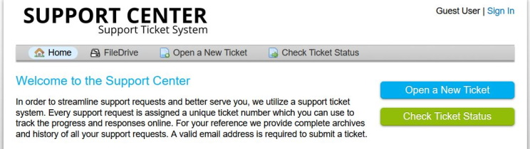
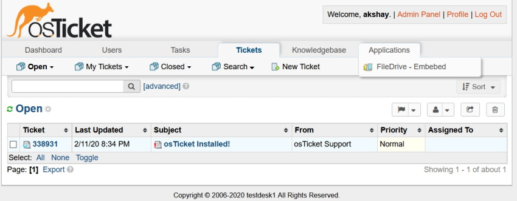
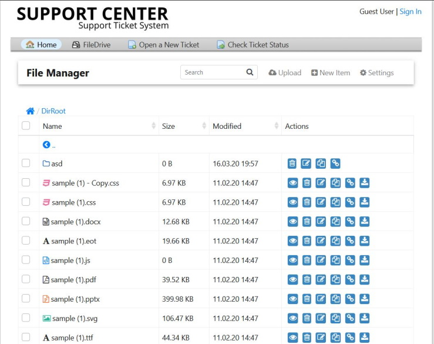

# FileDrive (Preview)
osTicket Plugin: Integrate file sharing facilities like google Drive ,OneDrive, Dropbox
  

## How it looks

  

  

 
  
## Installation
1. Extract all files in OSTicket "FileDrive" directory.
2. Make sure the plugin directory is named "FileDrive" (this is important).
3. NOTE: pleas touch the folder "_copy_to_root" , nothing is need here.
4. Paste/Move the "FileDrive" directory into folder ``Osticket Root > include > plugin ``
5. configure file Drive **"fd-config.php"**  _`(this is temporary version , after some version all setting can be configured form the plugin section of OStickets.)`_
6. Navigate to: https://your.domain/support/scp/plugins.php?a=add to add a new plugin.
7. Click "Install" next to "FileDrive"
8. Now the plugin needs to be enabled & configured, so you should be seeing the list of currently installed plugins, pick the checkbox next to "FileDrive" and select the "Enable" button.
9. Now you can configure the plugin, click the link "FileDrive" and choose who the plugin should be activated for, or keep the default.

## UnInstallation
1. Navigate to admin plugins view, click the checkbox and push the "Delete" button.
2. The plugin will still be available but uninstalled , you have to deleted the config only at this point, to remove permanently, remove two folders
* OsTicket_DIR `/plugins/fileDrive`
* OsTicket_DIR `/fd`

    
## TODO
1. fix the error on cron job

---
thank to [tinyfilemanager](https://github.com/prasathmani/tinyfilemanager)
